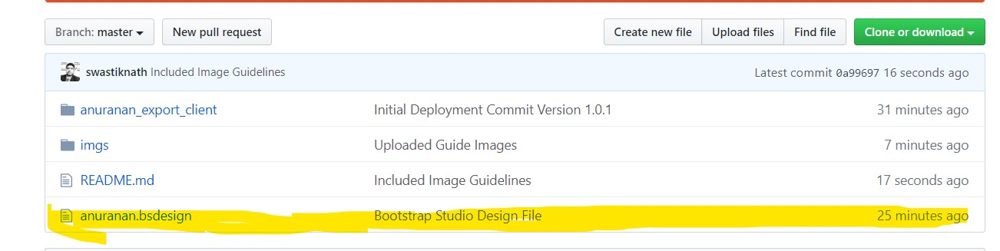

# PositionX Machines Research
- Client ID: PXM_2020_4344_48_3902
- DATE OF ATTACHMENT : 23-04-2020
- DATE OF DELIVERY   : 23-04-2020
- FRAMEWORKS IN USE  : HTML, CSS, JAVASCRIPT, JQUERY, BOOTSTRAP, CLOUDFLARE
Website for Client Anuranan Sahitya Gosthi.

### Instructions:

1. Download the Repository as a **ZIP** and then unzip the repository. 

2. Now head to Bootstrap Studio and Click on Open and Browse to the Bootstrap Design File.
   The following is the file that you should import to the Bootstrap Studio.
   

3. Select Import.
4. Start Editing the Design. 

5. Happy Building :)

For queries, [Support Email](mailto:swastiknath@positionxmachines.tech)
